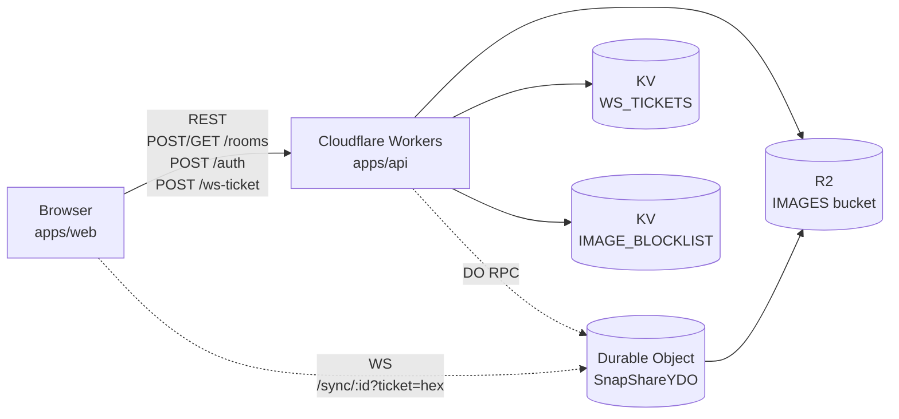

# 01. Overview — 全体像

> [← INDEX](./INDEX.md) | 次: [02-monorepo-and-tooling](./02-monorepo-and-tooling.md)

## pitamark とは (アーキ視点で)

画像にリアルタイム共同編集で注釈 (矩形 / 矢印 / テキスト / ハイライト) を付け、URL 一発で共有できる Web エディタ。SaaS でも desktop でもなく、**ブラウザ単体で完結する CRDT エディタ + 短命ストレージ** を Cloudflare のエッジで実現している点が中核。

製品の概要 / 競合は [README](../../README.md) と [ADR-0003](../adr/ADR-0003-web-vs-desktop-direction.md) を参照。本章はコード視点で「何が・どこで・どう繋がっているか」のみ扱う。

## 3-tier 構成



- **Browser**: React 19 SPA。Konva で canvas、Yjs クライアントで CRDT 状態を保持。
- **Worker**: Hono on Cloudflare Workers。REST 受付 + WS upgrade ゲート + DO ルーティング。
- **Durable Object**: ルーム単位の単一インスタンス。Yjs document を in-memory で保持し、idle 時は Hibernation でメモリ解放、TTL 期限で R2 / 自身を破棄。
- **R2**: 画像バイナリと room メタ JSON (`rooms/{id}/meta.json`) を保存。
- **KV**: 短命データ専用 — 60 秒 WS チケットと画像 SHA-256 ブロックリスト。

詳細な経路は [04-api-anatomy](./04-api-anatomy.md) と [07-flows](./07-flows.md) で。

## 主要技術リスト

| レイヤ | 採用技術 | 採用理由 |
|---|---|---|
| Web SPA | React 19 + Vite + Tailwind v4 | 標準構成 |
| Canvas | Konva (`react-konva` 19) | オーナー経験 + 軽量 (~80KB gz) |
| CRDT | Yjs + y-websocket + y-protocols | 業界標準。WebsocketProvider で provider 抽象化 |
| API | Hono 4.12 + `@hono/zod-openapi` + Scalar | 型安全な OpenAPI ([ADR-0001](../adr/ADR-0001-orpc-for-room-crud.md), [ADR-0002](../adr/ADR-0002-hono-zod-openapi-tanstack-stack.md)) |
| 実行基盤 | Cloudflare Workers + Durable Object + R2 + KV | エグレス無料 + 月額 $5 以下運用目標 |
| 同期 DO | `y-durableobjects` 1.0.5 | y-websocket 互換、Hibernation 対応 ([spike report](../spikes/REPORT.md)) |
| SSOT | `packages/shared` (Zod) | web/api で同一 schema を参照 (build step なし) |
| i18n | 自作 dict (ja/en) + `useSyncExternalStore` | ライブラリレス、軽量 ([ADR-0004](../adr/ADR-0004-i18n-strategy.md)) |
| 認証 | HS256 JWT (24h) + 60s WS ticket | wrangler tail への JWT 流出回避 |
| ボット対策 | Cloudflare Turnstile | 無料、Cloudflare 完結 |
| Lint/Format | Biome 2.4 | ESLint + Prettier 統合 |
| Test | Vitest 4 + Playwright (chromium) | CI で turbo run test / test:e2e |
| Monorepo | pnpm workspaces + Turborepo | catalog で依存版ロック |

## LocalEditor / RoomEditor 二刀流

URL 構造で 2 モードに分岐する。これが pitamark の中核設計。

| URL | モード | 状態管理 | サーバ依存 |
|---|---|---|---|
| `/` | **LocalEditor** | `useAnnotationsStore` (`useReducer` ベース) | なし (画像未投入時は landing) |
| `/r/:id` | **RoomEditor** | `useYjsAnnotationsStore` (`Y.Doc` + `Y.UndoManager`) | あり (WS + R2) |

`apps/web/src/pages/EditorPage.tsx` が `roomId` 有無で `React.lazy` 分岐し、`vite.config.ts` の `manualChunks` で **Yjs / Konva は別 vendor chunk** に切り出される。LocalEditor 利用時は Yjs ネットワークコードをロードしない (perf 予算: main `index-*.js` ≤ 200KB gz)。

両モードは `EditorShell` で共通シェル化されており、`Annotation` データ型は完全に同一 ([packages/shared](../../packages/shared/src/annotation.ts) で定義した discriminated union)。状態管理レイヤだけ差し替わる構造。

詳細な対比は [05-web-anatomy](./05-web-anatomy.md) で。

## リポジトリ最上位 tree

```
snap-share/
├── apps/
│   ├── api/        # Hono on Cloudflare Workers
│   └── web/        # React 19 + Vite + Konva
├── packages/
│   └── shared/     # Zod SSOT (Annotation, Room schemas, constants)
├── spikes/         # ★ workspace 外。Phase 0 PoC を凍結保存
├── docs/
│   ├── adr/                # 意思決定記録 (WHY)
│   ├── spikes/             # Phase 0 検証ログ
│   ├── architecture/       # ★ 本ディレクトリ (HOW + WHERE)
│   ├── legal/              # privacy 等
│   └── observability.md    # 運用 HOW
├── .claude/
│   ├── PRPs/       # PRD / plan / report / review
│   └── rules/      # コーディング規約
├── .github/workflows/  # GitHub Actions
├── public/         # 静的アセット (favicon, og 画像)
├── biome.json
├── pnpm-workspace.yaml
├── turbo.json
├── tsconfig.base.json
└── README.md
```

## 次に読むファイル

- ツール設定が知りたい → [02-monorepo-and-tooling](./02-monorepo-and-tooling.md)
- 共通型定義の中身が知りたい → [03-shared-package](./03-shared-package.md)
- API 側のファイル構造が知りたい → [04-api-anatomy](./04-api-anatomy.md)
- web 側のファイル構造が知りたい → [05-web-anatomy](./05-web-anatomy.md)
