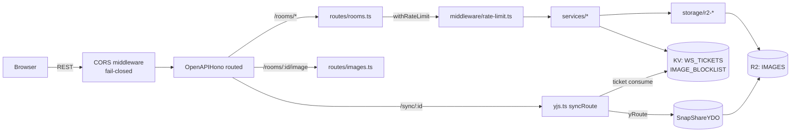

# 04. API Anatomy — `apps/api`

> [← INDEX](./INDEX.md) | 前: [03-shared-package](./03-shared-package.md) | 次: [05-web-anatomy](./05-web-anatomy.md)

`apps/api` は **Hono 4.12 on Cloudflare Workers + Durable Object (Yjs) + R2 + KV** の REST + WebSocket Worker。本章ではディレクトリ構成 → リクエスト経路 → 各ファイルの責務をマップする。

## API Endpoint 一覧

| Method | Path | Auth | Rate Limit | 用途 |
|---|---|---|---|---|
| `GET` | `/health` | — | — | Liveness check |
| `POST` | `/rooms` | Turnstile token (form) | `RL_CREATE_ROOM` (5/60s) | 画像 upload + room 作成 |
| `GET` | `/rooms/:id` | — (protected は `image` を hide) | — | Room メタ取得 |
| `POST` | `/rooms/:id/auth` | password (body) | `RL_AUTH` (10/60s) | パスワード検証 → 24h JWT 発行 |
| `POST` | `/rooms/:id/ws-ticket` | Bearer JWT | `RL_AUTH` (10/60s) | 24h JWT を 60s WS ticket に交換 |
| `GET` | `/rooms/:id/image` | protected は Bearer JWT | — | 画像バイナリ stream |
| `WS` | `/sync/:id?ticket=hex` | protected は ticket / public は IP RL | `RL_SYNC` (30/60s, public のみ) | Yjs CRDT 同期 |
| `GET` | `/api/openapi.json` | — | — | OpenAPI 3.1 仕様 |
| `GET` | `/api/docs` | — | — | Scalar UI |

すべての失敗レスポンスは共通エラー envelope `{ ok: false, error: { code, message } }` で返る (後述)。

## ディレクトリ構成

```
apps/api/src/
├── index.ts                  # OpenAPIHono / middleware / route mount / AppType export
├── yjs.ts                    # SnapShareYDO + /sync ticket gate
├── routes/
│   ├── rooms.ts              # POST /rooms / GET /:id / POST /auth / POST /ws-ticket
│   └── images.ts             # GET /:id/image
├── middleware/
│   └── rate-limit.ts         # withRateLimit factory (Workers RL binding, fail-open)
├── services/
│   ├── room-service.ts       # Room create / get / TTL 判定
│   ├── token-service.ts      # HS256 JWT 発行・検証 (24h)
│   ├── password-service.ts   # PBKDF2-SHA256 hash / verify (定数時間比較)
│   ├── ws-ticket-service.ts  # 60s WS ticket issue / consume (KV burn-on-consume)
│   ├── turnstile-service.ts  # Cloudflare Turnstile siteverify
│   └── image-blocklist-service.ts  # SHA-256 KV lookup (fail-open)
├── storage/
│   ├── r2-image-storage.ts   # 画像バイナリ put / get / delete
│   └── r2-meta-storage.ts    # rooms/{id}/meta.json put / get / delete (Zod 検証)
└── lib/
    ├── bindings.ts           # Env (R2 / DO / KV / RL / Secrets) の TS 型定義
    ├── error.ts              # AppError / ErrorEnvelope / onAppError / onAppNotFound
    ├── cors.ts               # parseAllowedOrigins / matchOrigin
    ├── token.ts              # issueRoomToken / verifyRoomToken (hono/jwt)
    ├── password.ts           # PBKDF2 derive / base64url
    ├── id.ts                 # generateRoomId (nanoid)
    ├── logger.ts             # structured logger (info/warn/error)
    ├── ip.ts                 # extractClientIp / redactIp (PII 圧縮)
    ├── sha256.ts             # Web Crypto SHA-256 → hex
    ├── schemas.ts            # OpenAPI 用の id param schema
    └── openapi.ts            # OpenAPI 3.1 doc config
```

## リクエスト経路



ポイント:
- **CORS は env 駆動の fail-closed**: `CORS_ALLOWED_ORIGINS` が空だと 例外を throw。誤設定を「沈黙」させない。
- **`syncRoute` は `app` に直 mount** (`routed` ではない): WS upgrade は `hc<AppType>` の対象外なので `AppType` から除外。Scalar UI / OpenAPI doc も同じ理由で `app` 直 mount。
- **`routed` 連鎖**: `app.get('/health').route('/rooms', roomsRoute).route('/rooms', imagesRoute)` — 2 つの route を同じ prefix にぶら下げる。

## ファイル別解説

### `apps/api/src/index.ts`

エントリポイント。`OpenAPIHono` インスタンスを作り、`use('*', cors(...))` で origin allowlist を fail-closed で適用、各 route を mount、最後に `notFound` / `onError` を共通ハンドラに繋ぐ。

```typescript
const app = new OpenAPIHono<{ Bindings: Bindings }>();
app.use('*', cors({ ... fail-closed origin check ... }));
const routed = app
  .get('/health', ...)
  .route('/rooms', roomsRoute)
  .route('/rooms', imagesRoute);
app.route('/sync', syncRoute);                  // AppType 外
app.doc31('/api/openapi.json', openApiDocConfig);
app.get('/api/docs', Scalar({ url: '/api/openapi.json' }));
export type AppType = typeof routed;
```

`SnapShareYDO` (および legacy 名 `YDurableObjects`) を `export` するのは Cloudflare Workers の DO bind 仕様 — wrangler.toml の `class_name` と一致するクラスを Worker module から export する必要がある。

### `apps/api/src/yjs.ts`

ふたつの責務を持つ:

1. **`SnapShareYDO` クラス** (`extends YDurableObjects`):
   - `onStart` で TTL alarm を 1 回だけ set (`getAlarm()` が null のときのみ)。`super.onStart()` を必ず最初に呼ぶ — `this.doc` は super 解決後でないと UB。
   - `alarm()` で R2 画像 + meta + DO storage を全削除。idempotent。
2. **`syncRoute`** (Hono ルータ):
   - `/:id` の入口で `ROOM_ID_REGEX` 検証 (path-traversal 拒否)。
   - room の存在確認 → protected なら **60 秒 WS ticket を consume** / public なら **`RL_SYNC` (IP keyed) で fail-open RL**。
   - 検証通過後 `yRoute<{ Bindings }>((env) => env.Y_ROOM)` に委譲。

`syncRoute` は **`OpenAPIHono` ではなく素の `Hono` + `.use()`**。`y-websocket` 専用で `hc` クライアントから叩かないため `AppType` には乗せない。これは Decisions Log の「`OpenAPIHono.use()` chain 禁止」ポリシーと矛盾しない (AppType 露出がないため)。

### `apps/api/src/routes/rooms.ts`

CRUD + auth + ws-ticket の 4 エンドポイント。各 route は `createRoute({ middleware })` パターンで `withRateLimit(...)` を挟み、`@hono/zod-openapi` で OpenAPI schema を生成する。

主要な処理フロー (`POST /rooms`):

1. multipart form を `uploadFormSchema.parse` (image: `z.instanceof(File)`, password: `z.string().max(256)` optional)
2. MIME 検査 (`ALLOWED_IMAGE_MIME_TYPES`) → 415
3. size 検査 (`MAX_IMAGE_BYTES`) → 413
4. `turnstile-service.verify(token)` → 401
5. `sha256` で hash → `image-blocklist-service.isBlocked(hex)` → 422
6. password ありなら `password-service.hash(password)` で `RoomAuth` 生成
7. `r2-image-storage.putImage(file)` で R2 に upload
8. `r2-meta-storage.putMeta(roomId, RoomStored)` で meta.json 保存
9. protected なら `token-service.issue(roomId)` で 24h JWT 発行
10. `RoomCreatedSchema.parse(...)` で 201 を返す (server 側で必ず `parse`)

### `apps/api/src/routes/images.ts`

`GET /rooms/:id/image` のみ。protected room は Bearer JWT 必須、public は誰でも取得可。R2 から binary を stream で返し、`Cache-Control` を public/private で切り分け。

### `apps/api/src/middleware/rate-limit.ts`

`withRateLimit({ binding, key })` 形式の middleware factory。Workers RL binding を呼び `success: false` なら 429。**RL binding 自身がエラーを投げた場合は fail-open** (= リクエストを通す) — RL の一時的な outage で API 全体が止まらないようにするため。`BYPASS_RATE_LIMIT="true"` で全 RL を short-circuit (E2E 用)。

### `apps/api/src/services/`

| ファイル | 役割 |
|---|---|
| `room-service.ts` | Room の create / get / TTL 期限判定。R2 storage と password / blocklist サービスを DI で受け取る。 |
| `token-service.ts` | HS256 JWT の `issue(roomId, secret)` / `verify(token, secret, roomId)`。`hono/jwt` 利用。`sub: roomId` で room 紐付け。 |
| `password-service.ts` | `hash(password)` で `RoomAuth` 生成 / `verify(auth, password)` で **定数時間比較**。PBKDF2-SHA256 / iterations 可変。 |
| `ws-ticket-service.ts` | `issue(roomId)` で 32 hex 文字を crypto.getRandomValues で生成 → KV に `ws-ticket:<hex>: roomId` で 60s TTL 保存。`consume(ticket, roomId)` で KV.get → match なら delete (burn-on-consume) |
| `turnstile-service.ts` | Turnstile siteverify endpoint を fetch。`BYPASS_TURNSTILE="true"` で skip (dev/CI)。 |
| `image-blocklist-service.ts` | KV `IMAGE_BLOCKLIST` に SHA-256 hex キーで lookup。KV 未設定 / エラー時は **fail-open** (画像通過)。Phase 7.5 runbook で provision 必須。 |

### `apps/api/src/storage/`

| ファイル | 役割 |
|---|---|
| `r2-image-storage.ts` | R2 IMAGES bucket への画像バイナリ I/O。`putImage(file)` / `getImage(key)` / `deleteImage(key)`。Cache-Control header 付与。 |
| `r2-meta-storage.ts` | R2 IMAGES bucket の `rooms/{id}/meta.json` 用。`putMeta(id, RoomStored)` / `getMeta(id)` で読込時に `RoomStoredSchema.parse` (壊れた meta は throw)。 |

R2 を image binary と meta JSON の両方に使い、Cache-Control 含めて R2 自体のエッジキャッシュに任せる構造。

### `apps/api/src/lib/`

| ファイル | 役割 |
|---|---|
| `bindings.ts` | Workers Env の TS 型定義。R2 / DO / KV / RL / Secrets / Vars 全 17 binding を一箇所で型付け。 |
| `error.ts` | `AppError` (HTTPException 拡張) + `ERROR_CODES` enum + `errorEnvelope` + `onAppError` / `onAppNotFound`。 |
| `cors.ts` | `parseAllowedOrigins(raw)` で `,` 区切りを parse、`*.example.com` ワイルドカード接尾辞対応。`matchOrigin(origin, rules)` で照合。 |
| `token.ts` | `issueRoomToken` / `verifyRoomToken`。`TOKEN_TTL_SEC = 86400` (24h)。 |
| `password.ts` | PBKDF2 (`crypto.subtle.deriveBits`) + base64url encode/decode。 |
| `id.ts` | `generateRoomId()` で `nanoid(21)` (URL-safe)。 |
| `logger.ts` | `info` / `warn` / `error` を structured JSON で `console` に。 |
| `ip.ts` | `extractClientIp(req)` で `cf-connecting-ip` 等から取得、`redactIp(ip)` で末オクテットを伏字 (PII 圧縮)。 |
| `sha256.ts` | `Web Crypto SHA-256 → 64 文字 hex`。 |
| `schemas.ts` | `roomIdParamSchema` などの OpenAPI 用 path schema。 |
| `openapi.ts` | OpenAPI 3.1 doc の info / servers / security 設定。 |

## エラー envelope の構造

[apps/api/src/lib/error.ts](../../apps/api/src/lib/error.ts):

```typescript
export const ERROR_CODES = [
  'INVALID_REQUEST',         // 400
  'UNSUPPORTED_MEDIA_TYPE',  // 415
  'PAYLOAD_TOO_LARGE',       // 413
  'NOT_FOUND',               // 404
  'UNAUTHORIZED',            // 401
  'UNPROCESSABLE_ENTITY',    // 422 (画像 blocklist hit など)
  'RATE_LIMITED',            // 429
  'INTERNAL',                // 500
] as const;

type ErrorEnvelope = {
  ok: false;
  error: { code: ErrorCode; message: string };
};
```

`AppError extends HTTPException` を route 内で `throw` するか、`return c.json(errorEnvelope(...), status)` で直接返す。`onAppError` が unhandled なら必ず `INTERNAL / 500` に converge。stack trace はサーバ側 log のみ (client には漏らさない)。

ロギングでは `sanitizePath()` で path から ASCII 制御文字を strip し、log injection を防ぐ。

## 型はどこから流れてくるか

```
packages/shared (Zod schema)
  ├──→ apps/api  routes で req body を parse, response を parse して返す
  └──→ apps/web  api-client で response を safeParse、ローカルでは型のみ参照

apps/api index.ts
  └──→ export type AppType = typeof routed
        └──→ apps/web  hc<AppType>(...) で型安全な REST client
              (※ /sync と /api/* は AppType に乗せない)
```

`packages/shared` を **第一の SSOT**、`AppType` を **第二の SSOT (REST routing 用)** と捉えると整理しやすい。

## 次に読むファイル

- WS ticket / DO Hibernation / Konva の仕組み深堀り → [06-realtime-and-konva](./06-realtime-and-konva.md)
- 各フローの時系列図 (auth / upload / sync / TTL) → [07-flows](./07-flows.md)
- web 側 → [05-web-anatomy](./05-web-anatomy.md)
