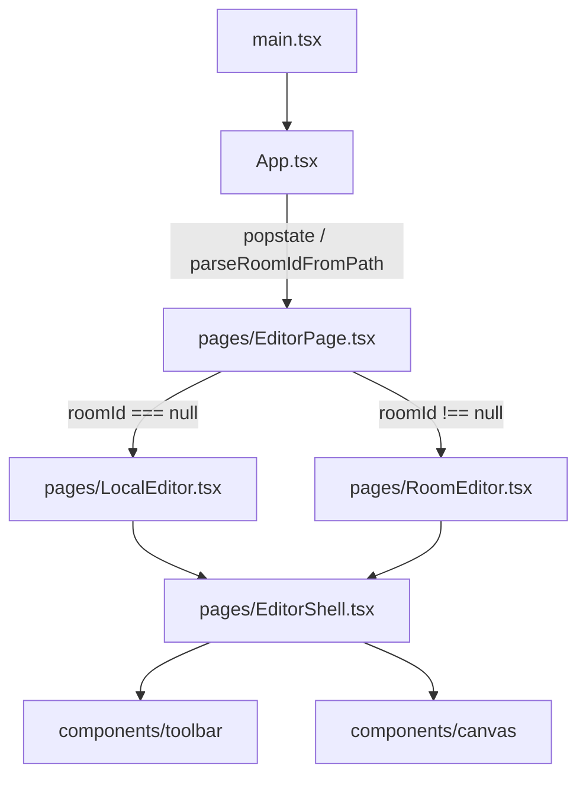

# 05. Web Anatomy — `apps/web`

> [← INDEX](./INDEX.md) | 前: [04-api-anatomy](./04-api-anatomy.md) | 次: [06-realtime-and-konva](./06-realtime-and-konva.md)

`apps/web` は **React 19 + Vite + Tailwind v4 + Konva + Yjs** の SPA。本章ではページ階層 → コンポーネント → 状態管理 → ファイル別責務をマップする。

## エントリ → ページ分岐



- `main.tsx`: `createRoot(...).render(<StrictMode><App /></StrictMode>)`。エントリ。
- `App.tsx`: `parseRoomIdFromPath(pathname)` で URL から `roomId` を抽出し `popstate` listener を貼る。Toaster (sonner) もここで mount。
- `pages/EditorPage.tsx`: `roomId` 有無で **`React.lazy`** 分岐。`vite.config.ts` の `manualChunks` と組み合わさって local mode は Yjs を fetch しない。
- `pages/LocalEditor.tsx` / `RoomEditor.tsx`: それぞれの状態管理 hook を構成して `EditorShell` に props を渡す。
- `pages/EditorShell.tsx`: 両モード共通シェル。Konva Stage / Toolbar / TextEditorOverlay / landing slot などをここで統合。

`<RoomEditor key={roomId} ...>` で `key` を渡すことで roomId が変わると **完全に unmount/remount** される。これが状態管理 hook の order を破壊しないための設計。

## ディレクトリ構成

```
apps/web/src/
├── main.tsx
├── App.tsx
├── vite-env.d.ts
├── pages/
│   ├── EditorPage.tsx       # lazy 分岐
│   ├── EditorShell.tsx      # 共通シェル
│   ├── LocalEditor.tsx      # ローカルモード (画像未投入時 landing)
│   └── RoomEditor.tsx       # room モード (Yjs + WS)
├── components/
│   ├── canvas/              # Konva 描画レイヤ (★後述)
│   ├── toolbar/             # ツール選択 / 色 / font / undo / export
│   ├── dialogs/             # HelpModal / ConfirmClearAllDialog
│   ├── landing/             # Hero / Features / HowTo / Faq
│   ├── room-gate/           # protected room の password form
│   ├── connection/          # WS 接続状態バッジ
│   ├── empty-state/         # DropZone
│   ├── lang-toggle/         # ja/en switch
│   ├── turnstile/           # Cloudflare bot widget
│   ├── ad/                  # AdSlot (rail / bottom)
│   ├── app-shell/           # app-level wrapper
│   └── ui/                  # shadcn/base-ui (button / input / dialog 等)
├── hooks/                   # ★状態管理の心臓部 (後述)
├── domain/
│   └── annotation/
│       ├── operations.ts    # immutable 操作 (add / move / resize / setText)
│       ├── yjs-mutations.ts # Yjs 用 mutator (LOCAL_ORIGIN + transact)
│       └── yjs-codec.ts     # Y.Map ↔ Annotation 双方向変換
├── i18n/
│   ├── index.ts             # useSyncExternalStore + localStorage persist
│   ├── ja.ts / en.ts        # 翻訳辞書
│   └── keys.ts              # I18nKey 型定義
├── lib/
│   ├── api-client.ts        # fetchRoom / createRoom / authenticateRoom / requestWsTicket
│   ├── yjs-config.ts        # LOCAL_ORIGIN re-export + resolveWsBaseUrl
│   ├── auth-storage.ts      # sessionStorage で token persist
│   ├── local-user.ts        # userId / displayName / color 生成
│   ├── colorCycle.ts        # activeColor cycle (C / Shift+C)
│   ├── fontSize.ts          # increment / decrement ([/])
│   ├── autoArrowDefault.ts  # 矩形 → 自動矢印の from/to 計算
│   ├── autoNextOffset.ts    # 矢印先端の text offset 計算
│   ├── exportPng.ts         # Konva Stage.toDataURL → Blob
│   ├── imageValidation.ts   # MIME / size validation (web 側)
│   ├── url-room.ts          # /r/:id parse + history.pushState
│   ├── id.ts                # nanoid wrapper
│   ├── logger.ts            # console wrapper (noConsole biome 例外)
│   └── utils.ts             # cn() (Tailwind class merger)
└── styles/
    ├── tokens.css           # CSS custom properties (--color-*, --space-* など)
    └── global.css           # preflight + typography
```

## 状態管理 2 系統

|  | LocalEditor | RoomEditor |
|---|---|---|
| 中心 hook | `useAnnotationsStore` | `useYjsAnnotationsStore` |
| 内部実装 | `useReducer` (`storeReducer`) | `Y.Doc` + `Y.Map<'annotations'>` + `Y.UndoManager` |
| Reducer | `annotationsReducer` + `historyReducer` を合成 | (なし。`yjs-mutations` で `doc.transact` を呼ぶ) |
| Undo/Redo | `historyReducer` の past/future 配列 | `Y.UndoManager` の trackedOrigins (`LOCAL_ORIGIN` のみ追跡) |
| 同期 | なし (1 ブラウザのみ) | `WebsocketProvider` 経由の binary diff |
| 永続化 | なし (リロードで消える) | DO 経由 R2 への TTL 付き保存 |
| 共通点 | 公開する Annotation 型 | 完全に同一 (packages/shared) |

LocalEditor / RoomEditor は **同じ `EditorShell` をマウントして、`annotations` と `dispatch` 系 props を別 hook から流し込む** 設計。`EditorShell` 側は両モードを意識しない。

## Hooks 一覧 (`hooks/`)

| ファイル | 役割 |
|---|---|
| `useAnnotationsStore.ts` | LocalEditor 用。`useReducer(storeReducer, initial)`。`storeReducer` は `annotationsReducer` の結果を `historyReducer` で wrap (commit/replace の使い分け) |
| `useYjsAnnotationsStore.ts` | RoomEditor 用。`useYjsAnnotationsContext` (factory) を返す。中で `WebsocketProvider` の attach、ws-ticket の取得、annotations snapshot subscribe を行う |
| `annotationsReducer.ts` | `Tool` / `activeColor` / `activeFontSize` / `selectedId` / `editingTextId` / `annotations` の dispatch reducer |
| `historyReducer.ts` | `HistoryState<T>` (`past[]`, `present`, `future[]`)。`commit` / `replace` / `undo` / `redo` / `reset` の 5 アクション。`HISTORY_LIMIT = 50` |
| `useImageSource.ts` | dropzone 画像読み込み + `URL.createObjectURL` + `createRoom(file, password, turnstileToken)` で room 作成 |
| `useStageSize.ts` | `ResizeObserver` で stage container 寸法を追跡 |
| `useStageTransform.ts` | scale + x/y offset (zoom / pan)。`fitToViewport` / `setHundredPercent` / `zoomBy` / `panBy` |
| `useKeyboardShortcuts.ts` | V/R/A/T/H (tool切替) / Cmd+Z/Shift+Z (undo/redo) / Backspace (delete) / Cmd+S (export) / Cmd+0/1 (fit/100%) / ? (help) / `[`/`]` (font size) / C/⇧C (color cycle) / Enter (autoArrow 確定) |
| `useExportPng.ts` | `stage.toImage()` を Blob 化 + download。`AwarenessLayer` を一時非表示 |
| `usePresence.ts` | awareness state subscribe + cursor / selectedId broadcast。`useRafThrottle` で setCursor を rAF 単位に throttle |
| `useTurnstileToken.ts` | Turnstile widget の token 取得 |
| `useStateRef.ts` | 同一値の `useState` + `useRef` を返す utility (drag draft 用) |
| `presence-context.ts` | `PresenceContext` 抽象。awareness 操作を `usePresence` から切り離し |
| `yjs-annotations-context.ts` | `Y.Doc` + `Y.Map('annotations')` + `Y.UndoManager`+`WebsocketProvider` のセットアップ。`LOCAL_ORIGIN` を trackedOrigins に登録、`yAnnotations.observeDeep` で snapshot 更新を listener に流す。`applyDataAction` で `AnnotationsAction` を Y mutations に変換 |

## Canvas 周辺 (`components/canvas/`)

```
components/canvas/
├── CanvasStage.tsx       # Konva Stage 親。drag draft (rect/arrow) を useRef で保持
├── ImageLayer.tsx        # use-image で  読込 → KonvaImage。listening={false}
├── AnnotationLayer.tsx   # annotations を type で switch して shape を dispatch
├── shapes/
│   ├── RectangleShape.tsx  # Konva.Rect + drag + 4 corner resize (Transformer)
│   ├── ArrowShape.tsx      # Konva.Arrow + from/to endpoint drag
│   ├── HighlightShape.tsx  # Konva.Rect (opacity) + resize
│   └── TextShape.tsx       # Konva.Text + drag + double-click → edit
├── TextEditorOverlay.tsx # text 編集中の DOM contenteditable overlay
├── AwarenessLayer.tsx    # 他ユーザーの cursor / selection ポリゴン
└── colors.ts             # Konva 用の hex リテラル (tokens.css と手動 sync)
```

設計上の罠は [06-realtime-and-konva](./06-realtime-and-konva.md) §1〜§3 に集約。

特に注意:
- **`ImageLayer` は `<Layer listening={false}>` + `<KonvaImage listening={false}>`**。これがないと画像が pointer event を吸収して `e.target === stage` 判定で annotation 描画が始まらない。
- **`CanvasStage` の `dragStart` / `draft` は `useRef`** で同期参照する。`useState` だと同じクリックサイクルの `mouseup` から見えない。
- **`colors.ts` と `styles/tokens.css` は手動同期**。Konva は Canvas 2D を使うため CSS 変数を解釈できない。

## i18n

`i18n/index.ts` は `useSyncExternalStore` ベースで lang を global subscribe させる:

```typescript
const subscribe = (cb: () => void) => { listeners.add(cb); return () => listeners.delete(cb); };
const getSnapshot = () => currentLang;
export const useLang = () => useSyncExternalStore(subscribe, getSnapshot);
export const useTranslation = () => {
  const lang = useLang();
  return useCallback((key) => dict[lang][key], [lang]);
};
```

`setLang(lang)` で `document.documentElement.lang` 更新 + localStorage persist + listeners 通知。`LangToggle` コンポーネントが `setLang` を叩く。`ja.ts` / `en.ts` がフラットな string dict、`keys.ts` が `I18nKey` 型 (strict union)。

## API client (`lib/api-client.ts`)

REST 呼び出しの一元窓口。各関数は `RoomCreatedSchema` / `AuthResponseSchema` / `WsTicketResponseSchema` などを `safeParse` してから返す:

| 関数 | 叩く endpoint |
|---|---|
| `createRoom(file, password?, turnstileToken)` | `POST /rooms` (multipart) |
| `fetchRoom(id)` | `GET /rooms/:id` |
| `authenticateRoom(id, password)` | `POST /rooms/:id/auth` → JWT |
| `requestWsTicket(id, token)` | `POST /rooms/:id/ws-ticket` → 32hex ticket |
| `buildImageUrl(room, token?)` | `GET /rooms/:id/image` の URL 生成 |

`hc<AppType>` は型推論用、ランタイム fetch は素の `fetch` + Zod `safeParse` で行う方針 (Phase 8.x SSOT review #1 M1)。

## Vite 設定の要点

[apps/web/vite.config.ts](../../apps/web/vite.config.ts):

- **`htmlEnvPlugin(mode)`**: `index.html` の `%VITE_FOO%` を `loadEnv` で展開 (OGP / Analytics token 用)
- **`manualChunks` (関数形式)**: `konva` / `react-konva` / `use-image` を `vendor-canvas` に、`yjs` / `y-websocket` / `y-protocols` を `vendor-yjs` に分離。Vite 8 は rolldown ベースで関数形式のみ受付
- **dev proxy**: `/rooms` を `localhost:8787` (wrangler dev) に proxy。**`/sync` は proxy しない** — y-websocket のバイナリフレームを Vite WS proxy が壊すため
- **vitest**: `environment: 'happy-dom'` / coverage v8

## 次に読むファイル

- Konva / Yjs / DO / WS Hibernation の深堀り → [06-realtime-and-konva](./06-realtime-and-konva.md)
- フロー時系列図 → [07-flows](./07-flows.md)
- 用語集 + ハマりポイント → [08-glossary-and-pitfalls](./08-glossary-and-pitfalls.md)
