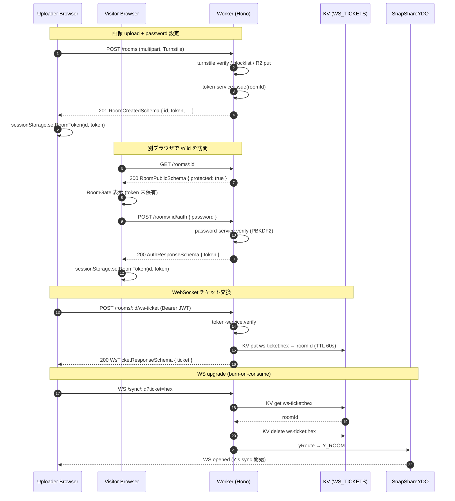
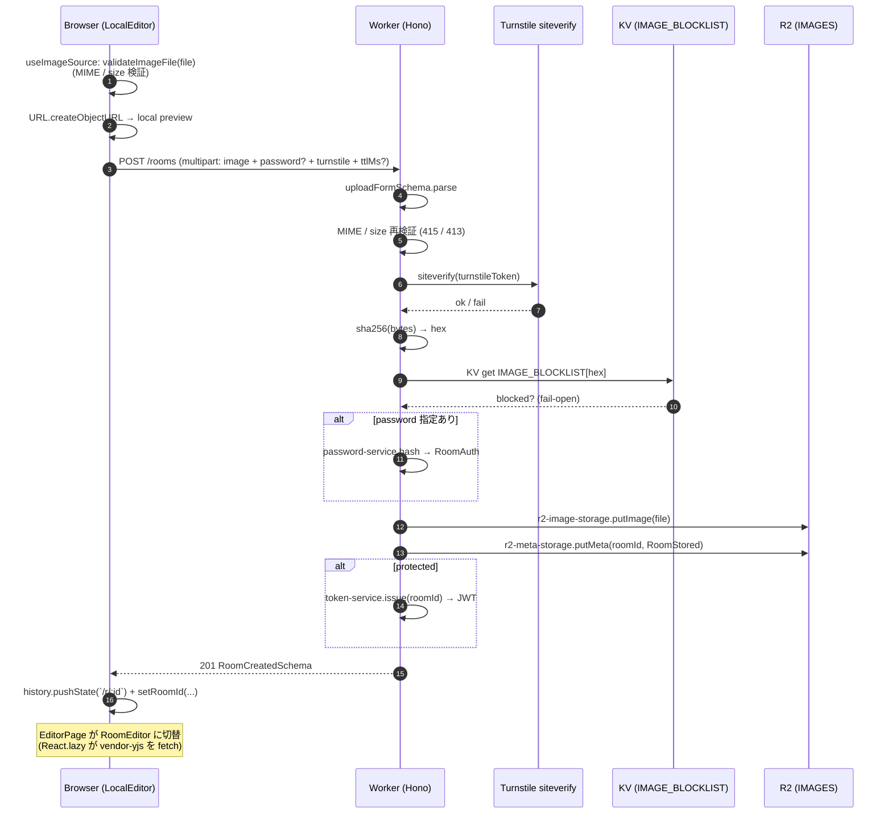
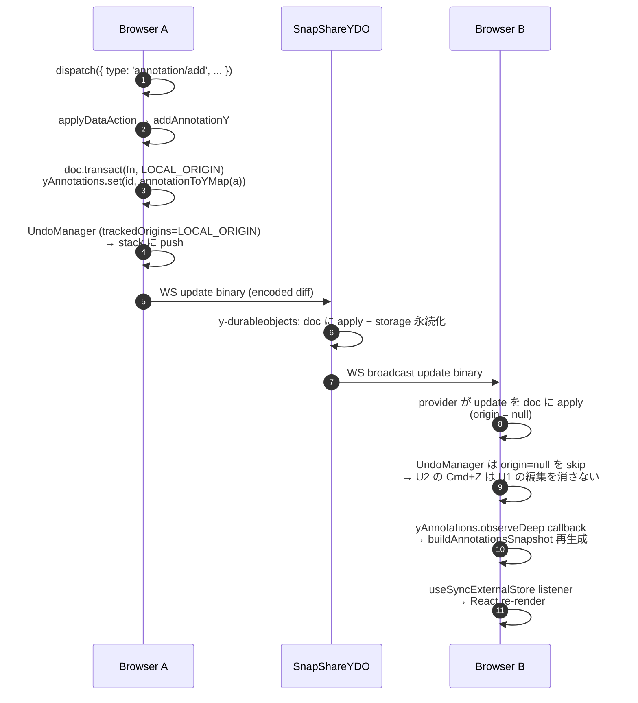
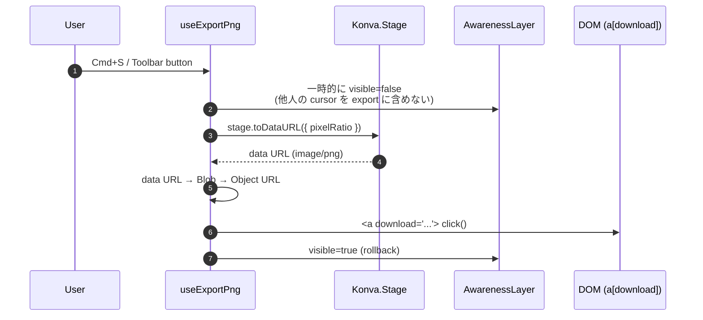
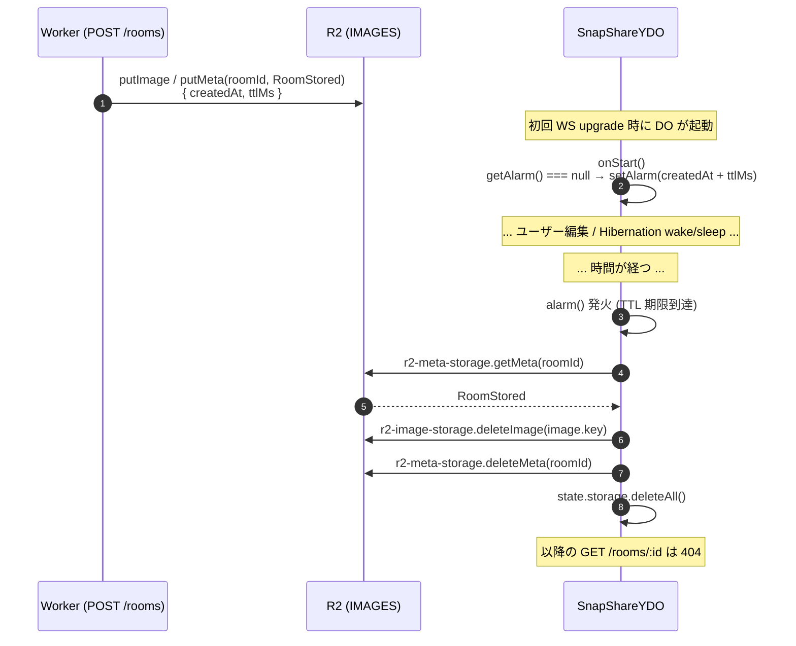

# 07. Flows — 主要フローのシーケンス図

> [← INDEX](./INDEX.md) | 前: [06-realtime-and-konva](./06-realtime-and-konva.md) | 次: [08-glossary-and-pitfalls](./08-glossary-and-pitfalls.md)

snap-share の 5 つの主要フローを **時系列のシーケンス図** で示す。各図の下に、登場するファイル・bindings・schema の参照リストを置く。

## §1 認証フロー (protected room)

protected room (パスワード付き) を **アップローダーが作成 → 別ブラウザで参加 → WebSocket で同期開始** までの全経路。

### 関連ファイル / schema

- API: `apps/api/src/routes/rooms.ts` (POST /rooms / POST /auth / POST /ws-ticket)
- API: `apps/api/src/yjs.ts` の `syncRoute` middleware (ticket consume)
- API services: `token-service.ts` / `password-service.ts` / `ws-ticket-service.ts`
- Web: `apps/web/src/components/room-gate/RoomGate.tsx` (auth form)
- Web: `apps/web/src/lib/api-client.ts` (`createRoom` / `authenticateRoom` / `requestWsTicket`)
- Web: `apps/web/src/lib/auth-storage.ts` (sessionStorage)
- Schema: `RoomCreatedSchema` / `AuthResponseSchema` / `WsTicketResponseSchema` (`packages/shared/src/room.ts`)

### 設計の意図

- **JWT は Authorization header だけに乗せる** (URL に乗せない)。WS upgrade URL は wrangler tail / Referer / browser history に残るため、ここに 24h JWT を置くと長時間の認証情報漏洩リスクになる
- **WS ticket は 60 秒で expire + 一度使ったら KV から削除** (burn-on-consume)。漏れても即無効化される

## §2 画像アップロードフロー

LocalEditor で画像を D&D してから、URL 共有可能な room として配信されるまで。

### 関連ファイル / schema

- Web: `apps/web/src/hooks/useImageSource.ts`
- Web: `apps/web/src/lib/imageValidation.ts` / `apps/web/src/lib/api-client.ts`
- API: `apps/api/src/routes/rooms.ts` の POST /rooms ハンドラ
- API services: `turnstile-service.ts` / `image-blocklist-service.ts` / `room-service.ts` / `password-service.ts` / `token-service.ts`
- API storage: `r2-image-storage.ts` / `r2-meta-storage.ts`
- API lib: `apps/api/src/lib/sha256.ts`
- Schema: `MAX_IMAGE_BYTES` / `ALLOWED_IMAGE_MIME_TYPES` / `RoomStoredSchema` / `RoomCreatedSchema` (`packages/shared/src/room.ts`)
- Bindings: `IMAGES` (R2) / `IMAGE_BLOCKLIST` (KV) / `RL_CREATE_ROOM` (RL) / `TURNSTILE_SECRET_KEY` (secret)

### 検証レイヤ

| 層 | チェック | エラー code |
|---|---|---|
| Web (`imageValidation.ts`) | MIME / size | i18n key 表示 |
| API schema (`uploadFormSchema`) | `instanceof(File)` / max(256) | 400 INVALID_REQUEST |
| API handler | `ALLOWED_IMAGE_MIME_TYPES` | 415 UNSUPPORTED_MEDIA_TYPE |
| API handler | `file.size > MAX_IMAGE_BYTES` | 413 PAYLOAD_TOO_LARGE |
| API handler | Turnstile siteverify | 401 UNAUTHORIZED |
| API handler | SHA-256 blocklist hit | 422 UNPROCESSABLE_ENTITY |
| API middleware | `withRateLimit(RL_CREATE_ROOM)` | 429 RATE_LIMITED |

## §3 Yjs 同期フロー

ローカル mutation がリモート peer に届くまでの内部経路。**LocalEditor では発生しない** (画像未投入 / `Y.Doc` 不在のため)。

### 関連ファイル

- Web hooks: `apps/web/src/hooks/yjs-annotations-context.ts` (Y.Doc + WebsocketProvider + UndoManager)
- Web hooks: `apps/web/src/hooks/useYjsAnnotationsStore.ts` (factory + ws-ticket 取得 + subscribe)
- Web domain: `apps/web/src/domain/annotation/yjs-mutations.ts` (LOCAL_ORIGIN + tx ヘルパー)
- Web domain: `apps/web/src/domain/annotation/yjs-codec.ts` (annotationToYMap / yMapToAnnotation)
- Web lib: `apps/web/src/lib/yjs-config.ts` (LOCAL_ORIGIN re-export + resolveWsBaseUrl)
- API: `apps/api/src/yjs.ts` (`SnapShareYDO` + `syncRoute`)
- 詳細メカニズム: [06-realtime-and-konva](./06-realtime-and-konva.md) §4–§6

### 罠の再掲

- **`LOCAL_ORIGIN` は同じ symbol を全箇所で共有**しないと UndoManager が正しく動かない (§5 参照)
- **arrow の `from`/`to` は `Y.Map` 上では `fromX/fromY/toX/toY` に flat 化**されている (§6 参照)
- **`yMapToAnnotation` は `safeParse` を挟む** ので、壊れた peer データは silent に skip される (Open Questions に該当: 壊れた entry を log で観測したいか — [08-glossary-and-pitfalls.md](./08-glossary-and-pitfalls.md) 参照)

## §4 Export PNG フロー

stage の現在の見た目を PNG として download する。

### 関連ファイル

- Web hooks: `apps/web/src/hooks/useExportPng.ts`
- Web lib: `apps/web/src/lib/exportPng.ts`
- Web canvas: `apps/web/src/components/canvas/AwarenessLayer.tsx` (visibility 制御)

### 罠

- **画像が CORS taint されていると `toDataURL` が SecurityError を投げる**。本番は web (Pages) と画像配信 (Workers) が別 origin なので、`useImage(src, 'anonymous')` で CORS-enabled fetch を強制する必要がある (§2 参照)
- **AwarenessLayer を非表示にする操作は同期的に再描画されないと export に間に合わない**。Konva の `Layer.draw()` を明示的に呼んで強制反映してから `toDataURL` する

## §5 TTL & 破棄フロー

ルーム作成から TTL 期限到達 → R2 / DO 自動削除まで。

### 関連ファイル

- API: `apps/api/src/yjs.ts` (`SnapShareYDO.onStart` / `alarm`)
- API storage: `r2-image-storage.ts` / `r2-meta-storage.ts`
- Schema: `DEFAULT_ROOM_TTL_MS` (24h) / `MAX_ROOM_TTL_MS` (7d) (`packages/shared/src/room.ts`)
- Bindings: `IMAGES` (R2) / `Y_ROOM` (DO) / `ROOM_TTL_MS` (var)

### 設計の意図

- **TTL を Worker 側 cron で回さない**: 全 room を走査する batch job は無駄。各 DO の Alarm に分散させた方がスケーラブル
- **`onStart` の冪等性**: Hibernation wake のたびに `onStart` が呼ばれるので、`getAlarm() === null` チェックがないと `setAlarm` が二重発火する
- **`alarm()` は idempotent**: 失敗時 Cloudflare 側がリトライする可能性があるので、削除済みリソースに対する重複 delete を吸収する設計 (R2 / DO storage の delete はどちらも 404 不問)

## まとめ

5 つのフローはすべて **「shared schema を介した型一貫性 + bindings 経由の I/O」** で組み立てられている:

| フロー | 鍵となる layer |
|---|---|
| 認証 | `RoomCreatedSchema` / `AuthResponseSchema` / `WsTicketResponseSchema` |
| 画像 upload | `RoomStoredSchema` + R2 IMAGES + KV IMAGE_BLOCKLIST |
| Yjs 同期 | `LOCAL_ORIGIN` symbol + `Y.Map` flat 化 + DO Hibernation |
| Export | Konva Stage.toDataURL + CORS anonymous |
| TTL | DO Alarm + R2 + DO storage の冪等 delete |

各 layer の責務分離は [04-api-anatomy](./04-api-anatomy.md) / [05-web-anatomy](./05-web-anatomy.md) / [06-realtime-and-konva](./06-realtime-and-konva.md) に対応するので、フローで詰まったらその章へ戻る。

## 次に読むファイル

- 用語集 + ハマりポイント + Open Questions → [08-glossary-and-pitfalls](./08-glossary-and-pitfalls.md)
- 環境変数 / デプロイ → [09-environment-and-deploy](./09-environment-and-deploy.md)
